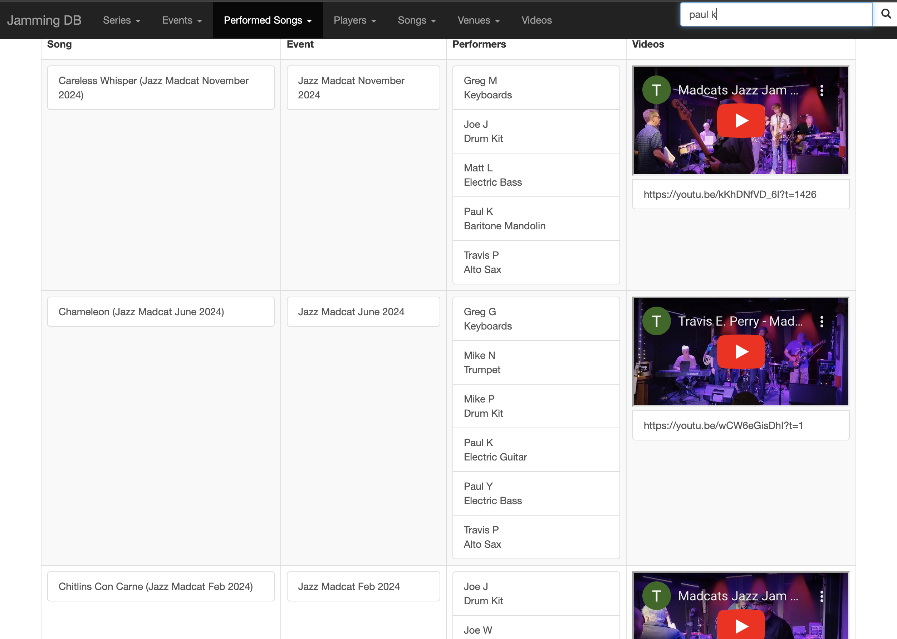

# JamDB

A Database and Flask app helping me keep track what songs I've played, where I've played, when I played, and who I've played with.

## Sample Screenshots 

### Songs
Provides information about songs, including charts, reference tracks, and links to performances of the song.
<p align="center">
  
</p>

### Performed Songs
Provided information about a particular performance of a song, including information about the gig, who played 
on the song, and links to recordings of the performance. 
<p align="center">
  
</p>


## Data
The app depends on the existence of a SQLite database in `data/app_data/jamming.db`.
We do NOT provide the database in the repo.

See [Data model](./docs/data_model.md)

## Docker Compose
To deploy  
```docker compose up --build```   
Main app will be available at `localhost:8989/`.


To run interactively in the container  
```docker compose run --rm server bash```
