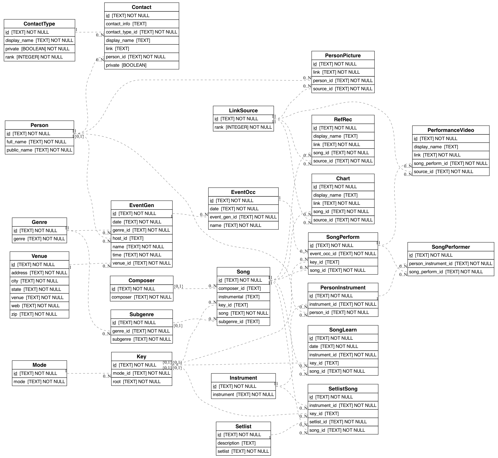

# JamDB


## Data
This depends on existence of `data/app_data/jamming.db`.
We do NOT provide the data in the repo.

### Data model
<p align="center">
  
</p>

## Setting up Docker

To deploy  
```docker compose up --build```   
App will be available at `localhost:8989/`.


To run interactively in the container  
```docker compose run --rm server bash```

When editing docker, be sure to inspect BOTH `Dockerfile` AND `compose.yaml`

