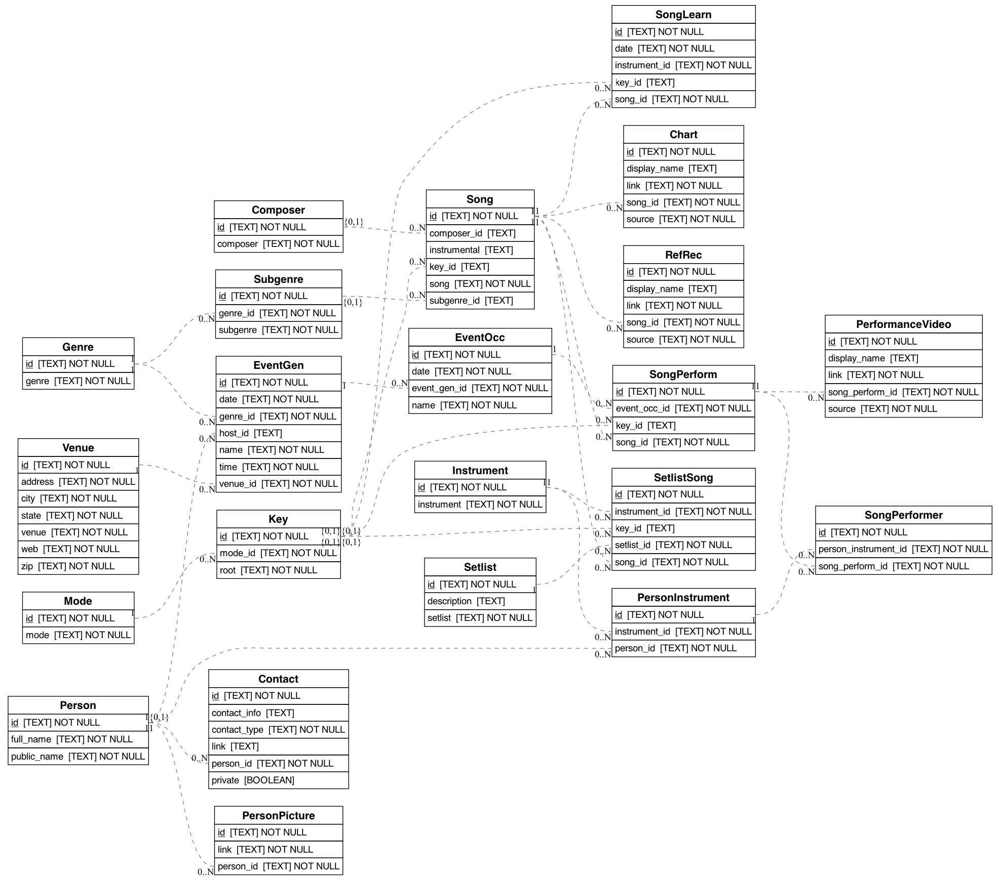

# Data Model

  

 

  <h2>Chart</h2>
  Links to charts for songs.
  <dl>
    <dt><b>id</b></dt><dd><i>Unique ID of the Chart.</i></dd></dt>
    <dt><b>song_id</b></dt><dd><i>ID of the Chart's song</i></dd></dt>
    <dt><b>source</b></dt><dd><i>Source of the chart, e.g., web link or iReal, etc.</i></dd></dt>
    <dt><b>link</b></dt><dd><i>Link, etc., url or uri</i></dd></dt>
  </dl>

 

  <h2>Composer</h2>
  Composer information
  <dl>
    <dt><b>id</b></dt><dd><i>Unique ID for Composer.</i></dd></dt>
    <dt><b>composer</b></dt><dd><i>Composer name.</i></dd></dt>
  </dl>

 

  <h2>Contact</h2>
  Contact information for a person, e.g., social media links.
  <dl>
    <dt><b>id</b></dt><dd><i>Unique ID for Contact info.</i></dd></dt>
    <dt><b>person_id</b></dt><dd><i>ID for the Contact's person.</i></dd></dt>
    <dt><b>contact_type</b></dt><dd><i>The kind of contact, e.g., Facebook vs YouTube etc.</i></dd></dt>
    <dt><b>contact_info</b></dt><dd><i>Free form text contact info, like phone numbers, etc.</i></dd></dt>
    <dt><b>link</b></dt><dd><i>Hyperlink, e.g., for Facebook etc.</i></dd></dt>
    <dt><b>private</b></dt><dd><i>Whether the contact info should remain private</i></dd></dt>
  </dl>

 

  <h2>EventGen</h2>
  Recurring events, including event's venue and the recurrence pattern.  Due to the data design, even one-off gigs are defined in EventGen.
  <dl>
    <dt><b>id</b></dt><dd><i>Unique ID for EventGen.</i></dd></dt>
    <dt><b>name</b></dt><dd><i>Name of EventGen, e.g., 'Jazz Madcats'</i></dd></dt>
    <dt><b>genre_id</b></dt><dd><i>ID of the genre, to distinguish between 'Blues' jam vs 'Open Mic', etc.</i></dd></dt>
    <dt><b>venue_id</b></dt><dd><i>ID of the event's venue.</i></dd></dt>
    <dt><b>date</b></dt><dd><i>Recurrence patter, eg. '3rd Thursday'</i></dd></dt>
    <dt><b>time</b></dt><dd><i>Time of the event, eg., '4:00 pm - 7:00 pm'</i></dd></dt>
    <dt><b>host_id</b></dt><dd><i>Person ID of the event's host.</i></dd></dt>
  </dl>

 

  <h2>EventOcc</h2>
  Specific events, including the event's specific date and EventGen that it derives from.
  <dl>
    <dt><b>id</b></dt><dd><i>Unique ID for the EventOcc.</i></dd></dt>
    <dt><b>name</b></dt><dd><i>Name of EventOcc, e.g., 'Jazz Madcat September 2024'</i></dd></dt>
    <dt><b>event_gen_id</b></dt><dd><i>ID of the recurring EventGen</i></dd></dt>
    <dt><b>date</b></dt><dd><i>Specific date of the EventOcc.</i></dd></dt>
  </dl>

 

  <h2>Genre</h2>
  Coarse genre information. Genres are at the level of 'Jazz' vs 'Blues', etc.  See also `SubGrenre`.
  <dl>
    <dt><b>id</b></dt><dd><i>Unique ID for Genre.</i></dd></dt>
    <dt><b>genre</b></dt><dd><i>Name of Genre.</i></dd></dt>
  </dl>

 

  <h2>Instrument</h2>
  Instrument information.
  <dl>
    <dt><b>id</b></dt><dd><i>Unique ID for Instrument.</i></dd></dt>
    <dt><b>instrument</b></dt><dd><i>Name of Instrument.</i></dd></dt>
  </dl>

 

  <h2>Key</h2>
  Key signature / mode information.
  <dl>
    <dt><b>id</b></dt><dd><i>Unique ID for key.</i></dd></dt>
    <dt><b>root</b></dt><dd><i>Root note of key, e.g, “Bb” or F#”, etc.</i></dd></dt>
    <dt><b>mode_id</b></dt><dd><i>ID of the mode.</i></dd></dt>
  </dl>

 

  <h2>Mode</h2>
  Information about mode.
  <dl>
    <dt><b>id</b></dt><dd><i>Unique ID of the mode.</i></dd></dt>
    <dt><b>mode</b></dt><dd><i>Descriptive name of the mode.</i></dd></dt>
  </dl>

 

  <h2>PerformanceVideo</h2>
  Video link for a performed song.
  <dl>
    <dt><b>id</b></dt><dd><i>Unique ID of the PerformanceVideo</i></dd></dt>
    <dt><b>song_perform_id</b></dt><dd><i>ID of the SongPerform</i></dd></dt>
    <dt><b>source</b></dt><dd><i>Source of the recording, e.g., YouTube or Spotify, etc.</i></dd></dt>
    <dt><b>link</b></dt><dd><i>Link, etc., url or uri</i></dd></dt>
  </dl>

 

  <h2>Person</h2>
  Public Information about a person.
  <dl>
    <dt><b>id</b></dt><dd><i>Unique ID for Person.</i></dd></dt>
    <dt><b>public_name</b></dt><dd><i>Person's publicly used name, typically their first name and last initial.</i></dd></dt>
    <dt><b>full_name</b></dt><dd><i>Person's full name.</i></dd></dt>
  </dl>

 

  <h2>PersonInstrument</h2>
  Which instruments are played by a given person.
  <dl>
    <dt><b>id</b></dt><dd><i>Unique ID for PersonInstrument.</i></dd></dt>
    <dt><b>person_id</b></dt><dd><i>ID of the Person.</i></dd></dt>
    <dt><b>instrument_id</b></dt><dd><i>ID of the Instrument.</i></dd></dt>
  </dl>

 

  <h2>RefRec</h2>
  Links to reference recordings of songs.
  <dl>
    <dt><b>id</b></dt><dd><i>Unique ID of the RefRec.</i></dd></dt>
    <dt><b>song_id</b></dt><dd><i>ID of the RefRec's song</i></dd></dt>
    <dt><b>source</b></dt><dd><i>Source of the recording, e.g., YouTube or Spotify, etc.</i></dd></dt>
    <dt><b>link</b></dt><dd><i>Link, etc., url or uri</i></dd></dt>
  </dl>

 

  <h2>Setlist</h2>
  Setlist information.
  <dl>
    <dt><b>id</b></dt><dd><i>Unique ID for SetList.</i></dd></dt>
    <dt><b>setlist</b></dt><dd><i>Name of the SetList.</i></dd></dt>
    <dt><b>description</b></dt><dd><i>Description of the SetList.</i></dd></dt>
  </dl>

 

  <h2>SetlistSong</h2>
  Information about songs on a Setlist, including song name, key, and which instrument I will play.
  <dl>
    <dt><b>id</b></dt><dd><i>Unique ID for the SetlistSong.</i></dd></dt>
    <dt><b>setlist_id</b></dt><dd><i>ID of the SetList that this SetlistSong belongs to.</i></dd></dt>
    <dt><b>song_id</b></dt><dd><i>ID of the Song.</i></dd></dt>
    <dt><b>instrument_id</b></dt><dd><i>ID of the instrument I will play for this SetlistSong.</i></dd></dt>
    <dt><b>key_id</b></dt><dd><i>ID of the SetlistSong's key.  This is provided to override if a particular SetlistSong requires playing in a key other than the Song’s default key.</i></dd></dt>
  </dl>

 

  <h2>Song</h2>
  Information about a song, including song name, key, etc.
  <dl>
    <dt><b>id</b></dt><dd><i>Unique ID of the Song.</i></dd></dt>
    <dt><b>song</b></dt><dd><i>Name of the Song.</i></dd></dt>
    <dt><b>subgenre_id</b></dt><dd><i>ID of the Song's Subgenre.</i></dd></dt>
    <dt><b>instrumental</b></dt><dd><i>Boolean as to if the song is an instrumental or not.</i></dd></dt>
    <dt><b>key_id</b></dt><dd><i>ID of the Song's Key.</i></dd></dt>
    <dt><b>composer_id</b></dt><dd><i>ID of the Song's Composer.</i></dd></dt>
  </dl>

 

  <h2>SongLearn</h2>
  Information about songs that I've learned, including instrument, key, and when I learned it.
  <dl>
    <dt><b>id</b></dt><dd><i>Unique ID of the SongLearn.</i></dd></dt>
    <dt><b>song_id</b></dt><dd><i>ID of the Song.</i></dd></dt>
    <dt><b>instrument_id</b></dt><dd><i>ID of the Instrument I learned the Song on.</i></dd></dt>
    <dt><b>date</b></dt><dd><i>Date when I learned the Song.</i></dd></dt>
    <dt><b>key_id</b></dt><dd><i>ID of the SetlistSong's key.  This is provided to override if a particular SongLearn's key is different than the Song's default key.</i></dd></dt>
  </dl>

 

  <h2>SongPerform</h2>
  Information about a particular performance of a song.
  <dl>
    <dt><b>id</b></dt><dd><i>Unique ID of a SongPerform.</i></dd></dt>
    <dt><b>event_occ_id</b></dt><dd><i>ID of the performed song's EventOcc.</i></dd></dt>
    <dt><b>song_id</b></dt><dd><i>ID of the performed song's Song.</i></dd></dt>
    <dt><b>key_id</b></dt><dd><i>ID of the performed song's key.  This is provided to override if a particular performance is in different than the Song's default key.</i></dd></dt>
  </dl>

 

  <h2>SongPerformer</h2>
  Information about performers on a given performed song.
  <dl>
    <dt><b>id</b></dt><dd><i>Unique ID of the SongPerformer.</i></dd></dt>
    <dt><b>song_perform_id</b></dt><dd><i>ID of the SongPerformed by the SongPerformer.</i></dd></dt>
    <dt><b>person_instrument_id</b></dt><dd><i>ID of the PersonInstrument of the SongPerformer.</i></dd></dt>
  </dl>

 

  <h2>Subgenre</h2>
  Granular genre information. Subgenres can be at the level of 'Bop' vs 'Swing', etc.  See also `Grenre`.
  <dl>
    <dt><b>id</b></dt><dd><i>Unique ID of the Subgenre.</i></dd></dt>
    <dt><b>subgenre</b></dt><dd><i>Name of the Subgenre.  Subgenre provides more granularity than Genre.  E.g., 'Jazz' as a Genre, 'Bop', 'Swing' etc as SubGenres of 'Jazz'.</i></dd></dt>
    <dt><b>genre_id</b></dt><dd><i>ID of the Genre.</i></dd></dt>
  </dl>

 

  <h2>Venue</h2>
  Information about a physical venue, including venue name, address, etc.
  <dl>
    <dt><b>id</b></dt><dd><i>Unique ID of the Venue.</i></dd></dt>
    <dt><b>venue</b></dt><dd><i>Name of the Venue, e.g, “Madcats”.</i></dd></dt>
    <dt><b>address</b></dt><dd><i>Street address of the Venue.</i></dd></dt>
    <dt><b>city</b></dt><dd><i>City of the Venue.</i></dd></dt>
    <dt><b>zip</b></dt><dd><i>Zipcode of the Venue.</i></dd></dt>
    <dt><b>state</b></dt><dd><i>State of the Venue.</i></dd></dt>
    <dt><b>web</b></dt><dd><i>Link(s) to Venue's website.</i></dd></dt>
  </dl>

